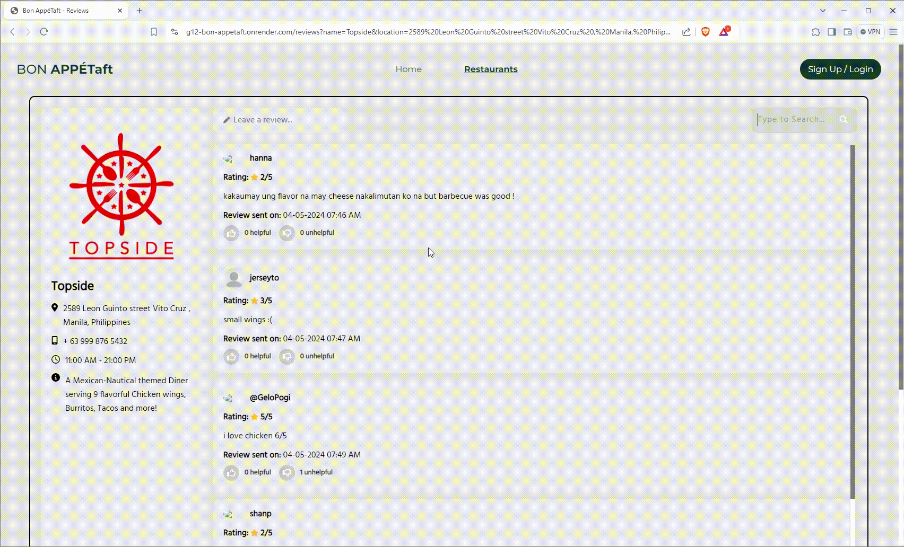

# BON APPÉTaft (restaurant-review)

BON APPÉTaft is a restaurant review website where users can sign up and login either as a customer or as an owner of a restaurant. The platform allows users to review restaurants and owners to manage their restaurant's profile and reviews.

## My Contributions
- Full stack development

## Collaborators
This project was developed in collaboration with:
- **Sophia Sarreal** - Frontend Developer
- **Danielle Faith Ang** - Full Stack Developer

## Features

- User authentication (signup, login, logout)
- Role-based access (Customer, Restaurant Owner)
- Restaurant listing and detailed views
- Review and rating system for restaurants
- Profile management for both customers and restaurant owners

## Tech Stack

- **Frontend**: Handlebars, CSS
- **Backend**: Node.js
- **Database**: MongoDB

## Deployment

The site is deployed on Render and can be accessed [here](https://g12-bon-appetaft.onrender.com/).

## Project Setup

1. Clone the repository:
    ```bash
    git clone https://github.com/chizkuhhh/restaurant-review.git
    cd restaurant-review
    ```
2. Install dependencies:
    ```bash
    npm install
    ```
3. Set up environment variables:
    - Create a `.env` file in the root directory
    - Add the following environment variables:
      ```plaintext
      MONGODB_URI = your_mongodb_uri
      SESSION_SECRET = your_session_secret
      ```
4. Run the application:
    ```bash
    npm start
    ```
5. Access the application at `http://localhost:3000`

## Demo




## Contact
For any inquiries, feel free to reach out to:
- Simone Franceska Emanuelle M. Capio - simone\_franceska\_capio@dlsu.edu.ph
